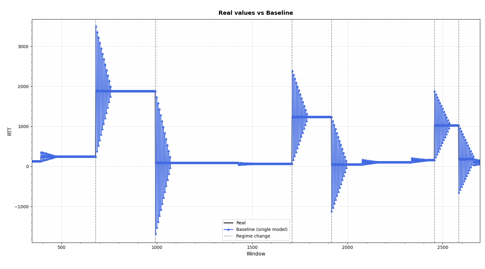
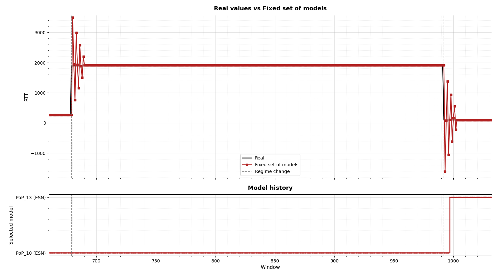
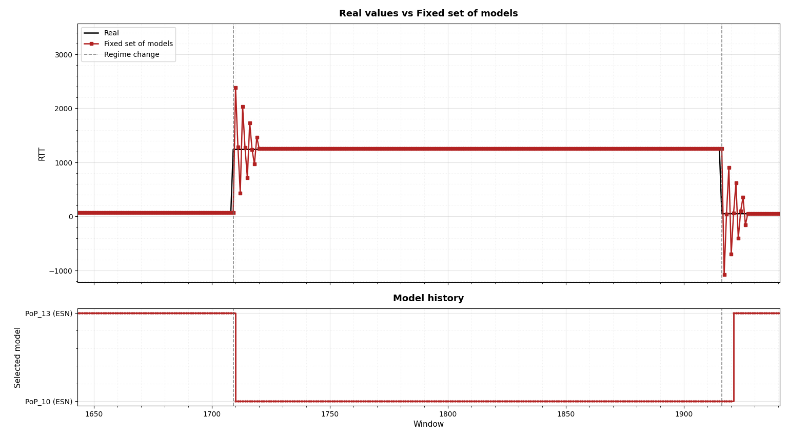
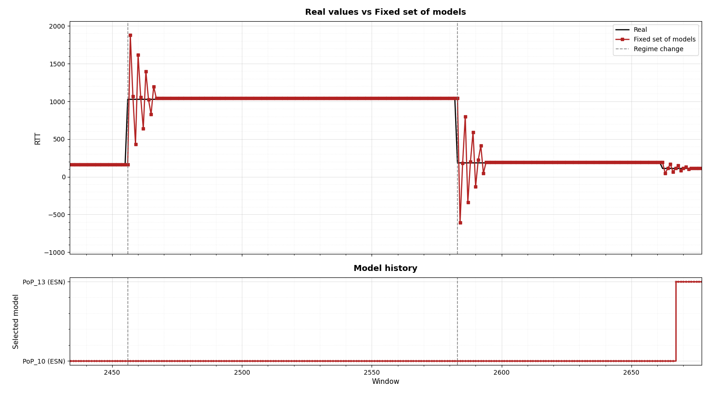
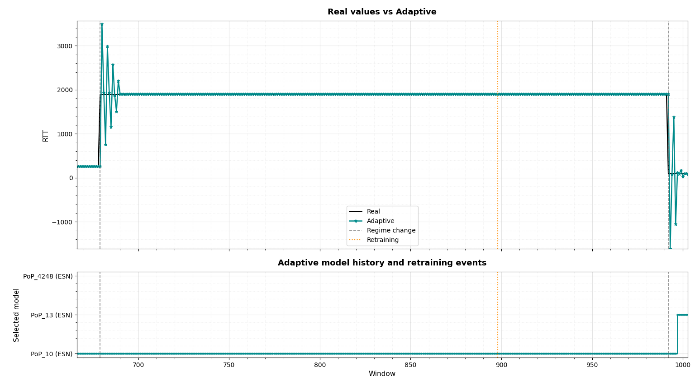
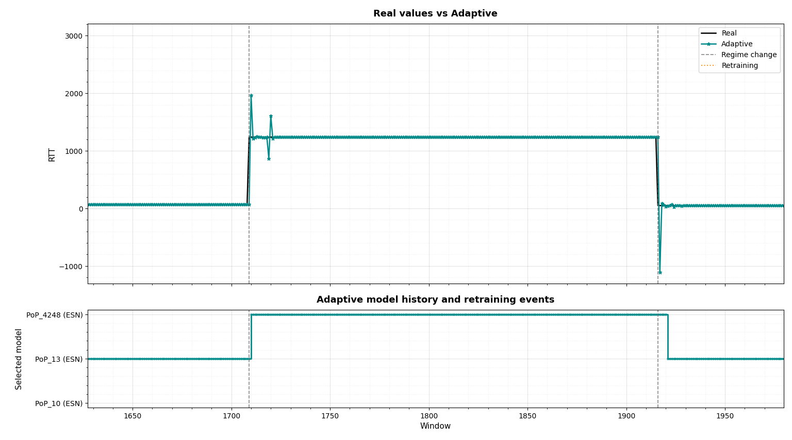
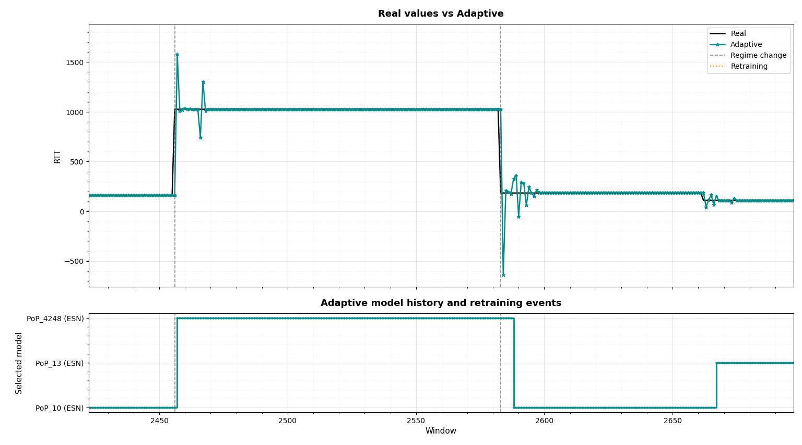
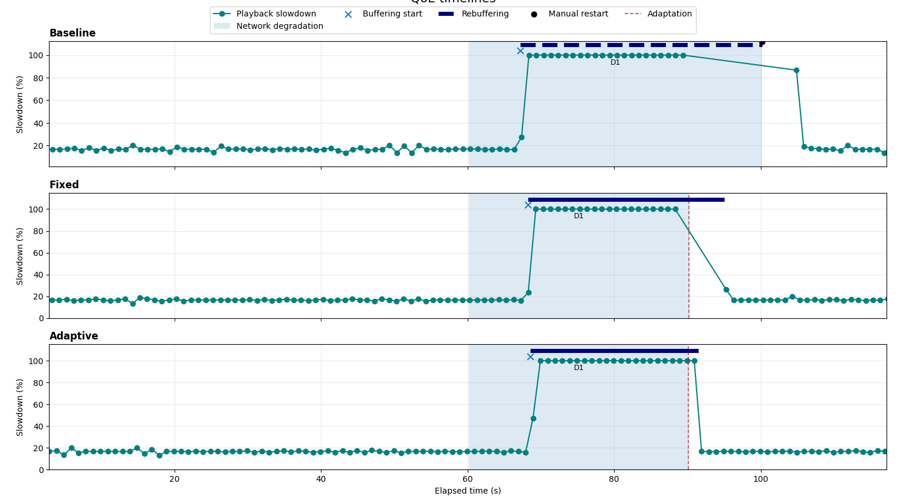
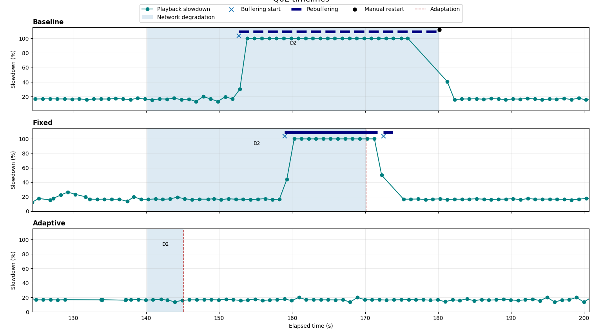
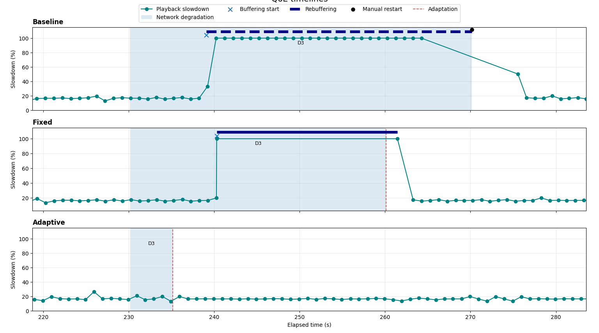

# Complementary Experimental Results

> **Purpose of this page.**  
> This README complements the results reported in the paper by providing a more detailed visual interpretation of the experiments.  
> The objective is not to repeat the paper, but to make the temporal behavior of the three strategies easier to inspect, especially **around QoS regime changes** and at the **application-level QoE**.

The comparison focuses on three strategies:

| Strategy | Principle |
|---|---|
| **Baseline** | A single prediction model is continuously reused and updated. |
| **Fixed** | Prediction is performed by selecting among a fixed pool of pre-trained models. |
| **Adaptive** | The model pool can evolve by retraining and integrating a new specialized model when a new QoS regime is encountered. |

The figures should be read in two steps:

1. **Prediction-level behavior** — how each strategy reacts around breakpoints.
2. **QoE-level behavior** — whether prediction stability translates into better streaming continuity.

---

# 1. Prediction-Level Analysis

## 1.1 Baseline — Instability around regime changes

The Baseline relies on a **single prediction model**.

The complete trace shows that prediction errors are concentrated around regime changes. After each breakpoint, the prediction can oscillate strongly before converging again toward the new RTT level.

  

<em>Baseline prediction behavior over successive QoS regime changes.</em>

The important observation is therefore not only the magnitude of the prediction error, but its **lack of stability around transitions**.

This behavior is consistent with the limitations of continuously adapting a single model in a non-stationary environment. In particular, it is compatible with **catastrophic forgetting and remembering effects**:

- adapting the same model to a new regime can degrade previously acquired knowledge;
- when an earlier regime reappears, the model does not necessarily recover a stable response immediately.

> **Takeaway — Baseline:**  
> The predictor can be accurate during stationary periods, but successive regime changes repeatedly destabilize it.

---

## 1.2 Fixed Model Pool — Better stability, but transition errors remain

The Fixed strategy addresses part of this limitation by selecting among a **fixed set of specialized models**.

Instead of continuously overwriting the knowledge of one predictor, the system can switch to a model that better matches the current QoS conditions.

This improves stability compared with the Baseline. However, the pool itself cannot evolve. If the current QoS regime is not sufficiently represented by one of the existing models, the system can only select the closest available option.

### Event 1

  

### Event 2

  

### Event 3

  

Across the three events, the Fixed strategy is more stable than the single-model Baseline, but **prediction oscillations remain visible around several breakpoints**.

The limitation is structural: the strategy can change models, but it cannot create a new one when the existing pool does not adequately represent the new operating condition.

> **Takeaway — Fixed:**  
> A fixed model pool reduces forgetting-related instability, but model selection alone is not sufficient when a new regime is missing from the pool.

---

## 1.3 Adaptive Model Pool — Learning from the first exposure

The Adaptive strategy starts from the same model-selection principle as Fixed, but adds one essential capability: **the model pool can evolve**.

When the available models are insufficient for the newly observed QoS regime, retraining can be triggered and a new specialized model can be integrated.

### Event 1 — Before the new regime has been learned

At **Event 1**, Adaptive behaves similarly to Fixed.

At this point, the new QoS regime has not yet been incorporated into the model pool. No specialized model is available for this condition, so prediction instability is still observed around the breakpoint.

  

This first exposure is important because it triggers the adaptation process.

A new specialized model, **`PoP_4248 (ESN)`**, is subsequently trained and integrated into the Adaptive model pool.

### Event 2 — After model integration

Once the new model is available, the Adaptive strategy can reuse the knowledge acquired during Event 1.

  

The response around the corresponding regime change becomes more stable than during the first exposure.

### Event 3 — Reuse of the learned regime

The same effect is visible again during Event 3.

  

The previously learned regime is now represented in the model pool, allowing Adaptive to react without reproducing the same level of instability observed during Event 1.

---

## Adaptive learning process

The sequence is best interpreted chronologically:

| Phase | What happens | Interpretation |
|---|---|---|
| **Event 1** | A new QoS regime is encountered. | Fixed and Adaptive behave similarly because the new condition is not yet represented by a specialized model. |
| **Detection / retraining** | The existing pool is insufficient and retraining is triggered. | The system learns from the first exposure. |
| **Model integration** | `PoP_4248 (ESN)` is added to the Adaptive pool. | The previously unseen regime now has a dedicated representation. |
| **Event 2** | A similar regime is encountered again. | Adaptive can reuse the newly learned model and predictions become more stable. |
| **Event 3** | The regime reappears. | The benefit of retaining the specialized model is observed again. |

> **Key point:**  
> Adaptive is **not expected to outperform Fixed immediately at Event 1**.  
> Its advantage appears **after learning from the first exposure**, once the new regime has been incorporated into the model pool.

---

# 2. Application-Level QoE Validation

Prediction stability is only useful if it improves the behavior of the running service.

For this reason, the prediction results are complemented with application-level QoE measurements under controlled network degradation.

The figures report the impact on:

- playback slowdown;
- buffering and rebuffering;
- service recovery;
- continuity of the video stream.

---

## 2.1 Event 1 — First exposure

  

During Event 1, **Fixed and Adaptive show a similar QoE degradation**.

This is consistent with the prediction results: Adaptive has not yet learned the new regime, so it does not yet have a specialized model that would distinguish its behavior from Fixed.

Both strategies therefore experience a significant playback slowdown and rebuffering.

The Baseline is affected even more severely. Its playback interruption is sufficiently strong that the stream does not recover automatically during the degradation period. A **manual restart is required to resume the stream**.

This first event therefore has two roles:

- it exposes the limitations of the current model pool;
- for Adaptive, it provides the experience that triggers retraining and learning of the new regime.

> **Interpretation — Event 1:**  
> The Adaptive strategy still pays the cost of discovering the new regime. Its advantage cannot appear before the new model has been learned and integrated.

---

## 2.2 Event 2 — Benefit after retraining

  

By Event 2, the Adaptive pool has already been extended with the newly trained model.

The difference between Fixed and Adaptive becomes clear:

- **Fixed** still exhibits a strong slowdown and rebuffering;
- **Adaptive** reuses the learned regime and maintains a much more stable application behavior.

The network degradation is still injected. What changes is the system's ability to react to it.

No rebuffering is observed for Adaptive during Event 2.

> **Interpretation — Event 2:**  
> This is the first event where the benefit of continual adaptation becomes clearly visible at the application level.

---

## 2.3 Event 3 — Persistence of the acquired knowledge

  

Event 3 confirms the same trend.

The Fixed strategy again experiences substantial slowdown and playback interruption because its model pool has not evolved.

Adaptive, in contrast, continues to reuse the knowledge acquired after Event 1.

No rebuffering is observed for Adaptive during Event 3.

> **Interpretation — Event 3:**  
> The gain obtained after retraining is not limited to a single transition. The learned model remains available and can be reused when the corresponding regime reappears.

---

# 3. From Prediction Stability to QoE

The central result of these supplementary experiments is the relationship between **prediction reliability** and **service continuity**.

| Strategy | Around breakpoints | Ability to learn a new regime | Observed QoE behavior |
|---|---|---|---|
| **Baseline** | Strong oscillations and repeated instability | No model pool | Severe playback interruption; manual restart required |
| **Fixed** | More stable than Baseline, but transition errors remain | No — pool is static | Automatic recovery, but significant rebuffering remains |
| **Adaptive — Event 1** | Similar to Fixed | Learning is triggered | QoE degradation still occurs |
| **Adaptive — Events 2 & 3** | More stable after model integration | Yes — learned model is retained and reused | No observed rebuffering |

The important distinction is therefore temporal:

**Before learning**

> New regime → no specialized model → prediction instability → QoE degradation

**After learning**

> New regime learned → specialized model retained → more stable prediction → improved QoE

---

# 4. Main Observation

These supplementary results clarify the mechanism behind the performance gains reported in the paper.

The contribution of the Adaptive strategy is not simply that it reduces the average prediction error. Its main benefit is that it improves **prediction reliability when the environment changes**.

The experimental sequence provides a clear illustration:

1. **Baseline** suffers from repeated prediction instability around regime changes, consistent with catastrophic forgetting and remembering effects.
2. **Fixed** improves stability by preserving several specialized models, but remains limited when the required regime is absent from the static pool.
3. **Adaptive at Event 1** initially behaves like Fixed because the new regime has not yet been learned.
4. The first exposure triggers **retraining and integration of `PoP_4248 (ESN)`**.
5. **Adaptive at Events 2 and 3** can then reuse this knowledge, leading to more stable predictions.
6. The QoE traces confirm the practical consequence: **no rebuffering is observed for Adaptive during Events 2 and 3**, while Fixed continues to experience interruptions.
7. The Baseline exhibits the most severe application-level failure, requiring a **manual restart of the stream** to continue playback.

> ### Overall conclusion
> **Continual adaptation turns a first failure to represent a new regime into reusable knowledge.**  
> The benefit becomes visible when the regime reappears: prediction stability improves, adaptation decisions become more reliable, and the impact of network degradation on the application is substantially reduced.

---

*These figures are provided as supplementary material to facilitate a detailed reading of the experimental behavior presented in the paper.*
